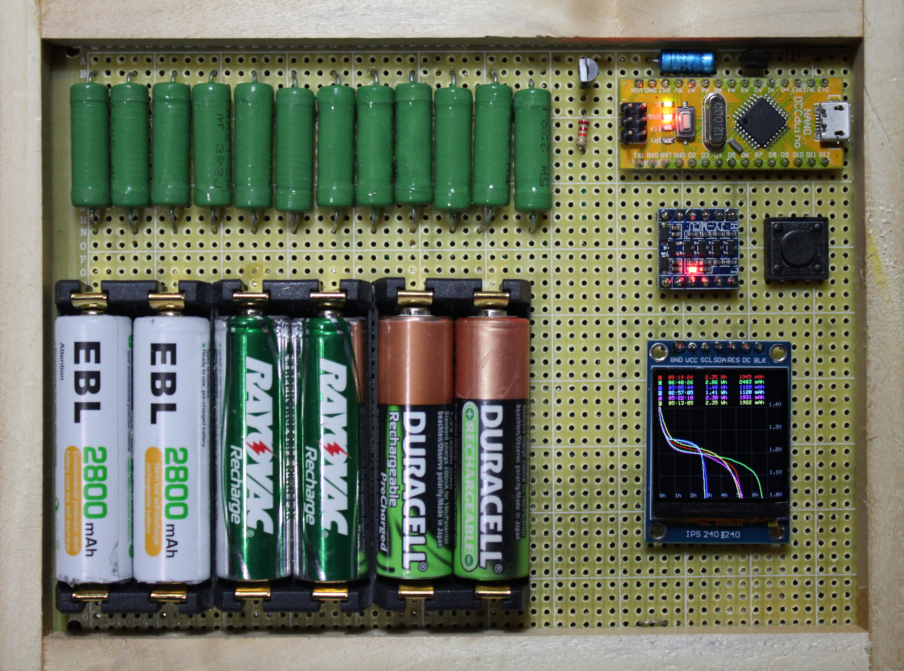

# NiMH AA Battery Tester

[Manual](doc/manual.md) &emsp; [Schematic](schematic/battery-tester.pdf) &emsp; [Source Code](src/battery-tester.ino)
## Intro
We have way too many rechargeable batteries around the house.  And while these should be carefully used in matched sets, labeled and tracked, none of this happens in real life.  You just grab some of the same brand, slam them into the 1-hour charger and get the impatient child's toy going again.

Result: They should work better than this.  Are they working anywhere near the advertised capacity any more?  Should they be thrown out and replaced by new ones?  Which ones are the closest match to combine into a set?

This tester was built to evaluate and match batteries.
## Test Method
After an optional trickle charge topup, discharge a fully charged battery into a load resistor, and measure how long it lasts until it crosses a low voltage threshold.  This tester additionally graphs the voltage versus time on a bitmap LCD and tallies up milliamp hours and watt hours - once a second computing the current from the voltage reading, and integrating that.  The stop threshold is 1.0 Volt, which based on observation is well after the discharge curve becomes steep, i.e. the battery is exhausted.  The load resistance is 3.3 ohms which gives a reasonable test length (overnight) for a high capacity cell in good condition.  When the stop threshold is reached, the load resistor is disconnected.

## User Interface
The tester has only one button.  When powered up, it prompts for the number of hours to trickle charge.  This can be changed by pressing the button.  Optionally, a long press will toggle between "then discharge" and "then stop" after the trickle charge.

The operation commences 15 seconds after powerup or the last button press.

Batteries that are detected are then discharged.  While discharging, the accumulated milliamp hours and watt hours are continously updated, as is a graph of voltage against time.  When a battery's voltage goes below 1.0 volt, the discharge of that battery stops and the discharge time, watt hours and milliamp hours are held.

During discharge, the button can be pressed to replace the watt hour counts with the current voltages.  The test will not be affected; nothing will stop it except powerdown or removal of the battery.

Generally a high-capacity NiMH in good condition will take 6-8 hours to fully discharge.  This is a compromise between discharge rate (lower would be better) and test time (should complete overnight)

If any battery is inserted backwards, the tester will detect this and refuse to operate.
