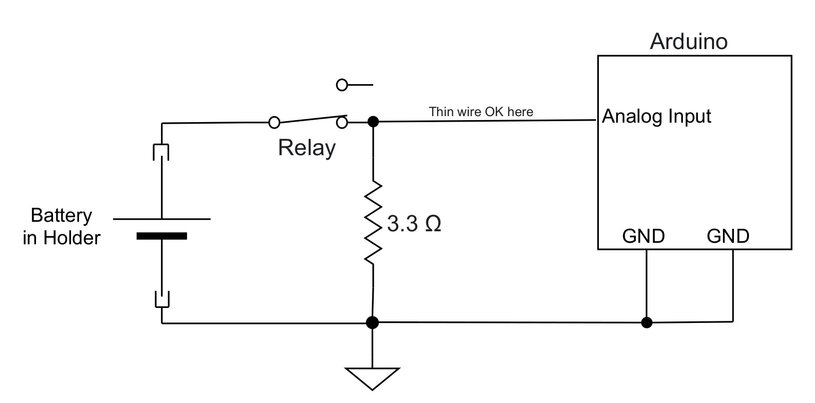

# NiMH AA Battery Tester Manual
# Usage

- **Do not power device using USB and wall adapter at the same time**  since both are connected to the same 5V rail.  The device will work on USB power alone except for charge mode.  The accuracy may be slightly reduced on USB power.
- **Do not insert batteries while the device is powered up.**  The backward battery test is only done at startup.
- A discharged battery (less than 1.0V into 3.3 ohm load at the start) will show as an empty socket
- The update sequence of the six channels changes every two minutes.  This is intentional to mix colours on the graph if graph lines coincide.
- Voltages higher than about 1.4V aren't shown on the graph.  You can press the button to obtain a voltage reading.
- After 8 hours the graph is full, but if the run continues it is still measured and tallied correctly.

# What if you discharge an Alkaline Cell?

These are the discharge traces of two different brand private label alkaline AAs.  The traces look pretty similar.  Watt hours aren't shown and the milliamp hours are less accurate because this test was done with an early version of the firmware.

Conclusions:

- It is practical to (destructively) compare cheap vs. expensive alkaline AA's with this tester
- An alkaline battery won't efficiently yield its energy into 3.3 ohms.

According to [Wikipedia](https://en.wikipedia.org/wiki/Alkaline_battery#Voltage) at this load an alkaline cell hits 1.0V with still about 20% energy remaining, and [elsewhere on Wikipedia](https://en.wikipedia.org/wiki/AA_battery#Comparison) it says that the rated capacity of an alkaline AA, 1800-2850mAh (presumably cheap private label ones are at the low end) is yielded at a 50mA discharge rate.  NiMH rechargeables work better for high loads.

# How it works
## Discharge Circuit
This is the important circuit of the tester.

Every connection shown, except as noted, is made of very heavy (14 gauge copper) wire to eliminate any change of stray resistance throwing off the measurement.  If there is extra resistance to either terminal of the battery holder, including in the relay, or in the Arduino's ground connection, the Arduino will see a lower voltage than at the battery.

The discharge loop wiring needs to be as low resistance as possible, so the load resistance on the battery really is 3.3 ohms and not more.  The firmware in the Arduino uses 3.3 ohms when converting voltage to current for displaying milliamp hours and watt hours.

The analog input pins on the Arduino draw only an immeasurably small amount of current so a thin wire can be used to hook them up.

A NiMH cell under load has a nominal output voltage of 1.2V.  The six discharge resistors burn 6\*1.2\*1.2/3.3 = 2.6W while doing the discharge test.  The 0.44W per resistor is far below the rated capacity of the 5W wirewound resistors, but still, they get almost too hot to touch over time and wirewound power resistors are built to take the heat.

## Reference Voltage for A/D conversion
The Arduino's analog-digital converter outputs a value of 0 if the analog input is at ground level, and a value of 1023 if the analog input is at the analog reference level.  Without anything connected to the AREF pin this defaults to the supply voltage.  However, the supply voltage isn't necessarily very precise, only having to be within +/- 10% of 5V.  For any kind of exact measurement, a more precisely regulated analog reference voltage is required.

A TL431 is used as it is commonly found in switching power supplies.  As connected here, it produces 2.5V.  The analog readings were still noisy with this configuration in a breadboard test, so the 10 microfarad capacitor was added.

The analog resolution is about 2.44mV per A/D converter step.  This is adequate for this application; however with a lower reference voltage (1.6V) the resolution would be higher.
## Trickle Charging
A fast charger can't be guaranteed to top up the batteries to exactly 100% full.  Trickle charging can.

Trickle charging is defined as a rate of C/10 or less, where C is the capacity of the battery.  So for example a 2800mAh battery can be trickle charged at 280mA.  Trickle charging does not need careful charge termination and can be left on overnight.  Most cheap overnight chargers work this way.

The trickle charge in this tester is meant to top up an already charged battery, not charge it from empty.

The charge relay is shown in the "active" position and the battery relay in the "inactive" position.  Current flows through the diode and the 22 ohm resistor to charge the battery.  The diode exists because otherwise all batteries not being discharged would be connected in parallel.  With the diode, current can only flow "into" the battery, not out of it.

With the 5 volt supply minus approximately 1.5 volts on a battery being charged, the current is 3.5V/22ohm = 159mA.  Batteries of less than 1590mAh capacity can still be topped up, just not for too many hours.

The charging circuitry is wasteful in that (5-1.5)/5 = 70% of the charge energy is just turned into heat by the 22 ohm resistor, for about (5-1.5V)\*0.159A = 0.56 watts per resistor.  This is far below the rated capacity of the 5W wirewound resistors, however they still get almost too hot to touch at 6\*0.56 = 3.36W of heat being generated continuously and a wirewound resistor is built to take the heat.
## Reverse Polarity Detection
To obtain precise readings, the batteries are connected directly to the Arduino's analog input pins when in discharge mode.  If this were to occur with a battery accidentally inserted backwards, the analog input pin would burn out.  The following circuit guards against accidental damage.

Resistor R13 tries to turn on transistor Q1, which then pulls the Arduino's input pin low.  This indicates "OK".

Any installed batteries will draw current away from the transistor's base connection through resistor R14, to try to turn the transistor off.  The exact turnoff voltage depends on the ratio of R13 to R14.  100 ohms was experimentally determined to turn off the transistor at about -16 millivolts on the lowest-voltage battery.
## I2C Voltage Conversion
The Arduino runs on 5V, whereas the LCD runs at 3.3V.  While it is possible to directly wire SPI between incompatbile voltage levels, a programming error (drive the Arduino pin to logic high as opposed to letting it be pulled to 3.3V via a pullup resistor) could damage the LCD.

A simple MOSFET circuit described on [this web site](https://www.hobbytronics.co.uk/mosfet-voltage-level-converter) shows how to convert SPI logic levels, with 5V pullups on the 5V side and 3.3V pullups on the 3.3V side.  Four of these are on the level converter module used here.
## Sources of Inaccuracy
This is a device that measures something.  While it works pretty well (+/- 1% or so) it is not a precision instrument.
### Stray Resistance
Heavy wire is used where stray resistance would throw the measurement off.

The battery holders are of a type that has very sturdy metal contact tabs.  The screw terminals on the relay module are tightened well.
### Load Resistor Accuracy
The load resistors are supposed to be 3.3 ohms.  Are they accurate?  The Arduino needs this value for voltage-current conversions.  It's hard to directly measure such a low resistance with a multimeter.  Instead, two multimeters and a power supply can be used.  One meter measures the current, the other the voltage.

The device, as built, shows 3.3 ohms +/- about 5% at the battery terminals in discharge mode.

It was not tested whether hot resistors have higher resistance than cold ones.
### Consistency between Channels
Even more important than the accuracy of the load resistors is that they all match.  The main point of this device is to find matching sets of batteries.

Before installation, all six resistors were connected in series to a power supply and the voltage across each was measured.  They matched within 0.1%.
### Analog Reference Accuracy
The TL431 device is not instrument grade.  It works well enough for this application.  The 10 microfarad filter capacitor on its output was necessary on a breadboard test and retained for the build.
### Conversion of A/D Converter reading to Millivolts
In the firmware, the following conversion is used on the sum of 1000 analog readings:

&emsp; millivolts = (100\*adc+20165) / 40330

The division is done like this to divide by 403.3 with exact rounding and still remain readable.

In theory the divisor should be 1023/2.5 = 409.2; however 403.3 was determined experimentally with a potentiometer, with the 2.5V analog reference built but no load resistors connected yet.

In practice, checking battery voltage with a multimeter and comparing to the voltage shown on the device (with two decimal places) I find the accuracy to be within +/- 1%.
### Electrical and A/D Converter Noise
Each voltage 1000 times per second tick and averaged.  The 1000 readings are interleaved between channels to space the readings out evenly over most of a second.  It was not tested whether this (having the A/D converter input constantly switching channels) is, in fact, less noisy than doing each batch of 1000 reads separately.

### Fixed-Point Arithmetic
The firmware uses only integer arithmetic.  If sub-integer precision is required, the units are changed instead.  For example to get volts with two decimal places, a "centivolt" unit is used.

When something needs dividing by something else, it is done like this:

&emsp; Result = (Input + Divisor/2) / Divisor

Where both Input and Divisor are scaled up enough to make Divisor/2 an integer.  This results in correct rounding.

Aside from the initial millivolt calculation, division operations are avoided for updating the milliamp hour and watt hour accumulators.  Dividing by 3.3 for the load resistance is only done just before displaying the results.  This avoids cumulative error from repeated rounding.
# Construction
## Materials
The list of electronic materials is at the end of the [Schematic](../schematic/battery-tester.pdf).
Other materials used to build the device as shown were:

- Prototyping board, 18x12cm with copper pads
- About 80cm of 14-gauge copper wire (from a stripped scrap of house wiring cable)
- About 30cm of foam double-sided adhesive tape
- Electrical tape
- Insulated hookup wire (from a stripped twisted pair cable such as Cat5)
- Wirewrap wire (optional)
- Solder

## Tools
Tools to construct the device as shown were

- Temperature regulated soldering iron with a fine tip
- Solder sucker or solder wick braid to fix soldering errors
- Dremel tool with a 1/16" PCB milling bit (optional - otherwise just a drill)
- Wirewrap gun (optional - otherwise solder everything)
- Small screwdriver for screw terminals
- Needlenose pliers
- Wire cutter
- Wire stripper
- Scissors
- Tweezers

## Method
Everyone has their own preferred style for a one-off project.  You may enjoy designing a custom printed circuit board, or you may just assemble it using breadboards and jumper wires.  The following shows how I made mine.

First, test the high pin count parts on a breadboard before soldering them in.  Run the firmware and make sure the LCD displays something.

Battery holders mounted.  I milled slots into the proto board using the dremel tool, bent the tabs straight and passed them through.  Round holes made with an ordinary drill would work too.

Considering the effort to control stray resistance, the heavy duty tabs (take a real effort to bend and real force to insert the batteries) are perfect.

Note the very heavy 14 gauge ground wire.  I ran it around in a loop to further reduce the resistance between the load resistors and the negative battery terminals.

Next, cover the part where the relay modules will go with two layers of electrical tape.

Mount the relay banks (one bank of eight would be better) using two layers of double-sided adhesive foam tape.  Make sure there are no shorts to the copper on the prototyping board.

In this picture the connections to the positive battery terminals are already made.

The 3.3 ohm load resistors are mounted.

And connected to the "normally open" terminals on the relays at one end, and the ground wire at the other.

The 22 ohm charge resistors are mounted.

And connected to the "normally closed" relay terminals at one end, and the charge diodes at the other.  The common end of the charge diodes goes to the "common" terminal on the charge relay.  Heavy hookup wire is used, but not the 14 gauge stuff.  Stray resistance here does not affect the measurement.

The ground connection to the Arduino could affect the measurement so it is of high quality.  Both ground pins are used.

Top side component view.  This is after the first overnight test run.  The reverse polarity circuit is still missing.  The components above the Arduino are the 2.5V analog reference.

Bottom wiring.  Noncritical connections are wirewrapped since I happen to have wirewrap stuff.

The power adapter is directly attached.  Otherwise plugging in the wrong type would burn out the Arduino.  Its AVR328 chip runs directly off the power adapter's regulated 5V.

## What I Would Do Differently Next Time
The power resistors get fairly hot.  They should be interleaved to alternate charge and load resistors to spread the heat out more.  They should be elevated above the board a bit by making their leads longer, for better air circulation.

The 1.3" display is inexpensive and functional, but a bigger one would be easier to read.
